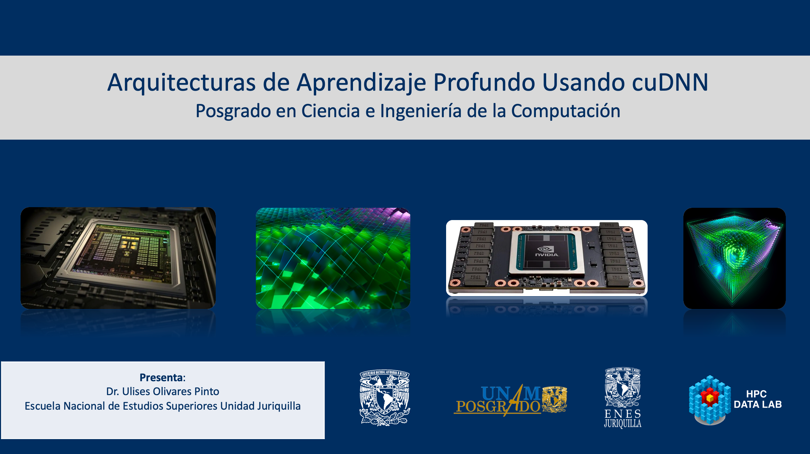

# Posgrado en Ciencia e Ingeniería de la Computación 

###  Semestre: 2022-1

## Profesores
 Dr. Ulises Olivares Pinto
 
 Dr. David Oswaldo Pérez Martínez

## Objetivo del curso
Presentar al estudiante la librería cuDNN para la aceleración de operaciones elementales en arquitecturas de aprendizaje profundo en distintos tópicos de las ciencias de la computación. 

## Prerequisitos
#### Deseables
+ Dominio de los lenguajes de programación C y C++ 
+ Conicimiento básico de estructuras de datos y algoritmos
* Fundamentos de programación en GPUs

#### Hardware
Se deberá contar con una computadora con un GPU NVIDIA o en su defecto solicitar acceso a un servidor remoto

#### Software
Se deberá contar con el siguiente software instalado 

  + [CUDA Toolkit](https://developer.nvidia.com/cuda-toolkit)
  + Entonrno de desarrollo integrado(IDE)
    - [Eclipse](https://developer.nvidia.com/nsight-eclipse-edition)
    - [Clion](https://www.jetbrains.com/es-es/clion/)
  + [cuDNN](https://developer.nvidia.com/cudnn)
    

#### Cuentas
Se deberán crear cuentas en las siguientes plataformas:
  + Crear una cuenta en GitHub
  + Google Classroom
  
## Contenido del curso
| No.        | Tema           | Conceptos |Código  |  Material complementario|
| :-------------: |:-------------| :-------------|:-----:| :-----|
| 1.              |Introducción a cuDNN          | Introducción a cuDNN, modelo de programación paralelo, arquitectura |   <ul> <li>[cuDNN Developer Guide](https://docs.nvidia.com/deeplearning/cudnn/developer-guide/index.html)</li></ul>    |  [Artículo seminal](https://arxiv.org/abs/1410.0759)
| 2.              |API C++ y modelo de programación          | Modelo de programación paralelo |   <ul> <li>[CUDA Samples](/code/cuda_samples_v11.4/Samples)</li><li>[cuDNN Samples](/code/cudnn_samples_v8)</li> <li>[Convolución simple](code/simple_convolution/conv.cu)</li></ul>    |  <ul> <li> [Getting Started](https://docs.nvidia.com/deeplearning/cudnn/index.html)</li> <li>[Guía de instalación](https://docs.nvidia.com/deeplearning/cudnn/install-guide/index.html) </li> </ul>
| 2.              |Convoluciones con cuDNN          | convoluciones, representación de memoria |   <ul> <li>[Convolución simple cudnn V8](code/simple_conv_cudnn_v8/conv.cu)</li> <li>[CmakeLists (Clion - cmake)](code/simple_conv_cudnn_v8/CMakeLists.txt)</li></ul>    |  <ul> <li>[cuDNN API Reference](https://docs.nvidia.com/deeplearning/cudnn/api/index.html)</li></ul>

**Última actualización: 08 de septiembre de 2021**
