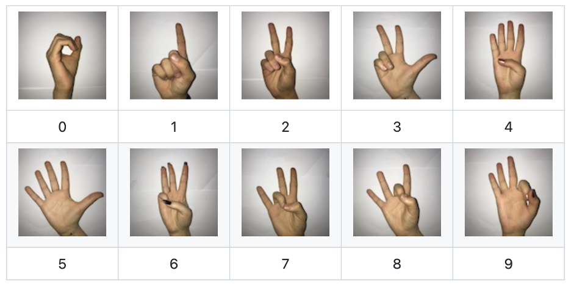

# Primer examen parcial práctico
## Redes Neuronales Convolucionales

Se deberá entrenar una Red Neuronal Convolucional para clasificar un conjunto de imágenes que representan digitos a travésd e lenguaje de señas.

 
El dataset se podrá descargar del siguiente repositorio 
https://github.com/ardamavi/Sign-Language-Digits-Dataset 

1. El proceso de entrenamiento se podrá realizar en cuDNN o en el Framework de su preferencia. Se podrán utilizar los pesos de modelos pre entrenados.  Podrán utilizar como referencia las arquitecturas definidas en:  
https://www.kaggle.com/ardamavi/sign-language-digits-dataset

2. El proceso de inferencia se deberá realizar exclusivamente en cuDNN.

### Entregables:
+ Descripción de la metodología para la obtención de resultados.

+ Resultados:
 >   + Presición del modelo  
+ Código fuente de la solución. 
